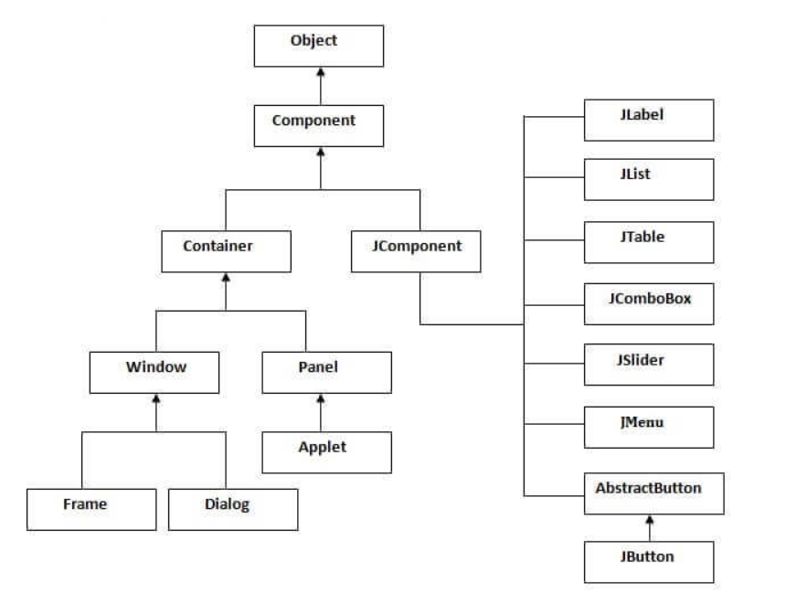

## Swing
Swing is used to create window-based applications. It is built on the top of AWT (Abstract Windowing Toolkit) API and entirely written in java.

Unlike AWT, Java Swing provides platform-independent and lightweight components.
### Hierarchy of java swing API

### Commonly used methods of component class

**Method** | **Description**
------------|-----------
 public void setSize(int width,int height) | sets size of the component.
 public void add(Component c) | add a component on another component.
 public void setLayout(LayoutManager m) | sets the layout manager for the component.
 public void setVisible(boolean b) | sets the visibility of the component. It is by default false.